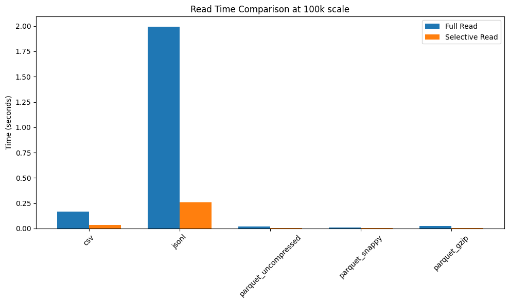
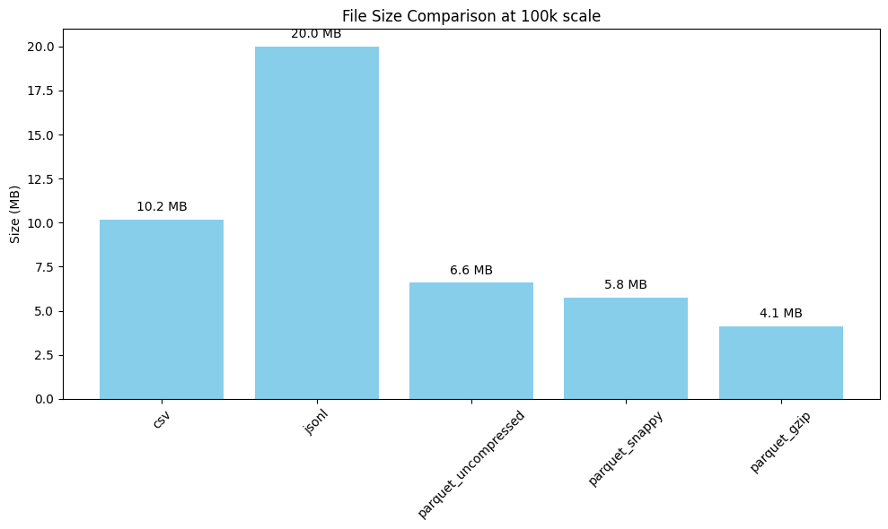
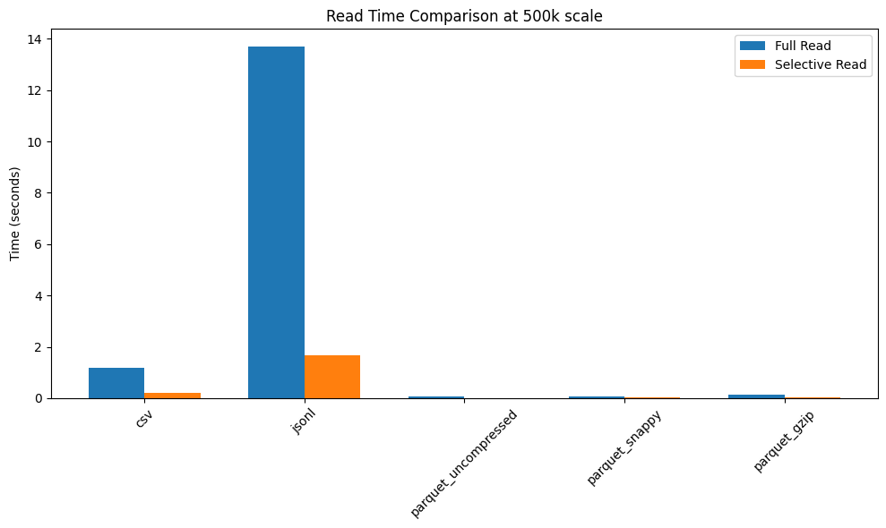
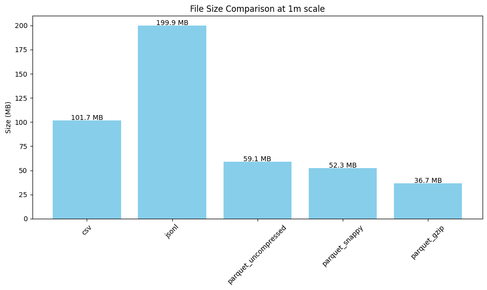

# Reporte de Formatos Bajo la Lupa

## Tablas Comparativas

### Escala: 100k
| Formato | Escritura (s) | Lectura Completa (s) | Lectura Selectiva (s) | Tamaño (MB) | RAM Pico (MB) |
|---------|---------------|----------------------|-----------------------|-------------|---------------|
| csv | 0.15 | 0.17 | 0.036 | 10.17 | 24.17 |
| jsonl | 0.19 | 1.99 | 0.256 | 19.99 | 244.70 |
| parquet_uncompressed | 0.03 | 0.02 | 0.003 | 6.59 | 7.12 |
| parquet_snappy | 0.04 | 0.01 | 0.003 | 5.76 | 5.76 |
| parquet_gzip | 0.56 | 0.02 | 0.004 | 4.11 | 4.12 |

### Escala: 500k
| Formato | Escritura (s) | Lectura Completa (s) | Lectura Selectiva (s) | Tamaño (MB) | RAM Pico (MB) |
|---------|---------------|----------------------|-----------------------|-------------|---------------|
| csv | 1.08 | 1.19 | 0.210 | 50.85 | 120.69 |
| jsonl | 1.19 | 13.70 | 1.681 | 99.97 | 1223.81 |
| parquet_uncompressed | 0.10 | 0.06 | 0.011 | 30.01 | 30.53 |
| parquet_snappy | 0.17 | 0.06 | 0.016 | 26.51 | 26.53 |
| parquet_gzip | 2.09 | 0.13 | 0.019 | 18.67 | 18.68 |

### Escala: 1m
| Formato | Escritura (s) | Lectura Completa (s) | Lectura Selectiva (s) | Tamaño (MB) | RAM Pico (MB) |
|---------|---------------|----------------------|-----------------------|-------------|---------------|
| csv | 1.73 | 1.78 | 0.288 | 101.70 | 241.34 |
| jsonl | 2.07 | 24.23 | 2.942 | 199.93 | 2447.82 |
| parquet_uncompressed | 0.19 | 0.11 | 0.020 | 59.11 | 59.63 |
| parquet_snappy | 0.28 | 0.12 | 0.019 | 52.28 | 52.29 |
| parquet_gzip | 3.30 | 0.22 | 0.028 | 36.68 | 36.69 |

## Gráficas de Rendimiento

### Escala 100k

### Escala 500k

### Escala 1m

## Conclusiones Técnicas y Análisis

Tras ejecutar el código y revisar los resultados obtenidos en el proceso de benchmarking para las tres escalas de datos (100k, 500k y 1 millón de registros), encontre diferencias reelevantes para cada formato de almacenamiento y su comportamiento en las condiciones planteadas.

**1. Orientación a Filas vs. Orientación a Columnas**
El método de almacenamiento ha influido de gran manera en la eficiencia de la lectura de datos. Los formatos orientados a filas (CSV y JSON Lines) requieren que el motor de lectura escanee el archivo secuencialmente registro a registro, incluso cuando el usuario únicamente solicita un subconjunto específico de atributos. Esto se observa claramente en los resultados: al solicitar una lectura selectiva de tan solo dos columnas (`amount` y `category`) en un millón de registros, el formato CSV apenas logra reducir el tiempo a 0.288s, mientras que Parquet Snappy denota una gran diferencia reduciendo el tiempo a 0.019s. Al almacenar la información agrupada por columnas de manera contigua, Parquet ignora por completo los bloques de datos de las columnas no solicitadas en el disco, evitando así el exceso de operaciones.

**2. Penalización por Parseo: Texto Plano vs. Binario Estricto**
Los formatos diseñados para ser más legibles como JSONL y CSV pagan un costo computacional demasiado grande. En cada ciclo de lectura, el motor de ejecución se ve forzado a convertir cadenas de texto plano, inferir tipos y realizar conversiones a estructuras de datos nativas (ej. transformar el string "2023-01-01" a un objeto `datetime` o un UUID a cadena de bytes). JSON Lines es particularmente lento en esta cuestión: su lectura completa en el dataset más grande con 1M de registros tarda 24.23 segundos, es decir, es más de 200 veces más lento que Parquet Snappy (0.12 segundos). 
Asimismo, debido a que el formato JSONL repite el nombre de cada llave (`"transaction_id"`, `"amount"`, etc.) en absolutamente cada fila, la memoria RAM requerida se dispara exponencialmente a aproximadamente 2.45 GB para almacenar solo 1 millón de registros. Por el contrario, Parquet, al ser fuertemente tipado y binario, es leído de manera nativa utilizando escasos 52 MB de RAM, un factor de mejora cercano a 47x frente a JSONL y 4.6x frente a CSV.

**3. Impacto de los Algoritmos de Compresión**
Dentro del espectro del formato Parquet, el análisis demuestra por qué la selección del algoritmo de compresión también es de gran importancia. GZIP ofrece un ratio de compresión mayor, resultando en el archivo más ligero (36.68 MB). Sin embargo, debido a su complejidad la escritura tarda 3.30s (más de 11 veces más lenta que Snappy). Snappy se confirma como el punto de equilibrio: no tiene el mayor ratio de compresión de las opciones vistas (52.28 MB), pero sus algoritmos están optimizados para velocidades mayores, lo cual se comprueba en los resultados con los 0.28s en escritura, empatando prácticamente con el formato sin compresión, y 0.12s en lectura.

**4. Análisis de Escalabilidad (100K vs 1 Millón)**
Al observar el cambio de comportamiento de los formatos a medida que el volumen de datos crece de 100,000 a 1,000,000 de registros (un aumento de 10x), destaca cómo algunos formatos se degradan rápidamente mientras que otros mantienen un rendimiento altamente escalable. 
La memoria RAM requerida por JSON crece proporcionalmente pero con un peso gigantesco: salta de ~244 MB para 100K registros a ~2.45 GB para 1 millón. Si este crecimiento se extrapola a un entorno real de 10 millones de filas, JSONL requeriría casi 25 GB de RAM solo para la lectura, volviéndolo inviable. En contraste, Parquet Snappy escala de manera sumamente eficiente: pasa de utilizar apenas 5.76 MB (100K) a solo 52.29 MB (1M). Asimismo, el tiempo de lectura completa de JSONL empeora enormemente al escalar (de 1.99s a 24.23s), mientras que Parquet Snappy absorbe el incremento masivo de datos manteniendo tiempos de lectura en el orden de los milisegundos (de 0.01s a 0.12s).
Aunque todos los formatos se ven afectados con el crecimiento del dataset, el que peor maneja las grandes cantidades en todos los aspectos es JSON.

En mi opinón, es importante resaltar una cosa: En cuestiones de memoría (Almacenamiento y RAM) el crecimiento es casi en todos los casos un aumento proporcional al crecimiento del dataset: un x10. Y en el resto de metricas Parquet destaca por tener un aumento menor a esta proporción.

## Recomendación para Producción

En base a la evidencia obtenida, para la arquitectura de almacenamiento de transacciones analíticas, **se recomienda implementar el formato Parquet con compresión Snappy**.

**Justificación para entornos de Producción:**
1. **Eficiencia en Costos de Almacenamiento y Cómputo:** Reduce el tamaño de los datos a la mitad frente al CSV tradicional, abaratando los costos de almacenamiento en la nube, y al mismo tiempo optimiza las horas de CPU facturadas por las herramientas de procesamiento al no requerir parseos exhaustivos.
2. **Escalabilidad y Seguridad en RAM:** Mantener un uso de memoria RAM de 52 MB frente a 2.4 GB por cada millón de registros permite naturalmente el procesar multiples particiones gigantescas en memoria de forma simultánea sin riesgo de sufrir errores críticos de falta de memoría. 

A pensar de la pequeña diferencia en tiempo de escritura al comparar Snappy al formato Parquet sin compresión, considero que los datos presentados demuestran una muy clara ventaja al usar Snappy en comparacion con cualquier otro formato.
